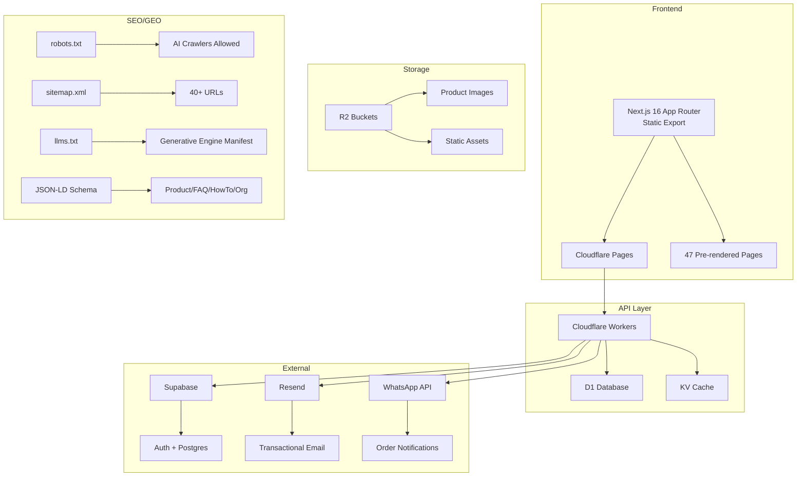

# AIPS OS Knowledge Map v1

> Generated by AIPS-DOMINATOR (Kimi Code) — 2026-05-20
> Source: Codebase audit + live site extraction + Notion workspace browser inspection

---

## 1. System Architecture



### Tech Stack

| Layer | Technology | Version | Purpose |
|-------|-----------|---------|---------|
| Framework | Next.js | 16.2.4 | React SSR/SSG framework |
| Router | App Router | — | File-based routing, RSC |
| Language | TypeScript | 5.9.3 | Strict mode |
| Styling | Tailwind CSS | 4.2.4 | Utility-first CSS |
| UI Components | shadcn/ui | latest | Accessible React components |
| ORM | Drizzle ORM | 0.31.10 | Type-safe SQL |
| Database | Supabase / D1 | — | Postgres / SQLite edge |
| Package Manager | pnpm | 9.15.9 | Monorepo/workspace |
| Node Runtime | Node.js | 24.15.0 | Build environment |

---

## 2. Full Product Catalog

### By Category (8 categories, 30 product pages, 56 SKUs)

| Category | Count | Products |
|----------|-------|----------|
| AI Assistant | 20 | ChatGPT Plus/Pro/Business/Go, Claude Pro/Max/Team, Gemini Advanced, SuperGrok, Perplexity Pro |
| AI Code | 6 | GitHub Copilot, Cursor Pro, v0.dev, Replit Core, Manus AI |
| AI Image | 9 | Midjourney, Ideogram, Leonardo AI, DALL-E, Stable Diffusion |
| AI Video | 4 | Runway, HeyGen, Pika, Sora |
| AI Voice & Music | 6 | ElevenLabs, Suno AI, Udio, Murf |
| AI Workspace | 5 | Notion Business, Gamma, Otter.ai |
| AI Writing | 1 | Writesonic |
| Bundles | 5 | Student Package, Freelancer Bundle, Business Package, B2B Implementation |

### Pricing Structure (BDT)

| Tier | Typical Price | Description |
|------|--------------|-------------|
| Starter Shared | ৳350–500 | Shared account, basic access |
| Premium Shared | ৳800–1,200 | Shared account, priority |
| Personal | ৳2,000–3,500 | Private account, full features |
| Business | ৳5,000–8,000 | Team/enterprise features |

### Payment Methods
- bKash Merchant Pay (primary)
- Nagad
- Rocket
- Local Visa/Mastercard
- Bank transfer (corporate)

### Delivery SLA
- Shared accounts: 5–30 minutes after payment
- Personal accounts: 15–60 minutes after verification
- Business accounts: 1–24 hours (setup + onboarding)

---

## 3. Full URL Map

### Static Pages (10)
| URL | Title | Schema |
|-----|-------|--------|
| `/` | Premium AI Subscriptions in Bangladesh | Organization, WebSite, HowTo, FAQ |
| `/products` | All AI Subscriptions | — |
| `/about` | About AI Premium Shop | Organization |
| `/contact` | Contact Us | ContactPoint |
| `/faq` | Frequently Asked Questions | FAQPage |
| `/blog` | Blog | — |
| `/terms` | Terms of Service | — |
| `/privacy` | Privacy Policy | — |
| `/robots.txt` | Crawler directives | — |
| `/sitemap.xml` | URL index | — |

### Comparison Pages (4)
| URL | Title |
|-----|-------|
| `/chatgpt-vs-claude` | ChatGPT vs Claude in Bangladesh |
| `/chatgpt-vs-gemini` | ChatGPT vs Gemini Advanced |
| `/copilot-vs-cursor` | GitHub Copilot vs Cursor Pro |
| `/midjourney-vs-ideogram` | Midjourney vs Ideogram |

### Blog Posts (3)
| URL | Title |
|-----|-------|
| `/blog/best-ai-tools-bangladesh-2026` | Best AI Tools Bangladesh 2026 |
| `/blog/how-to-get-chatgpt-plus-bangladesh` | How to Get ChatGPT Plus BD |
| `/blog/pay-ai-tools-bkash-bangladesh` | Pay AI Tools with bKash |

### Product Pages (30)
All under `/products/[slug]` with variant tables, FAQ schema, HowTo schema.

---

## 4. Brand Voice Cheatsheet

### Voice (3 paragraphs)

**AI Premium Shop speaks as Bangladesh's most trusted AI subscription partner.** We are direct, helpful, and technically precise — never salesy or vague. Every sentence delivers value: either a clear price, a specific benefit, or an actionable step. We understand the Bangladeshi customer's reality (no international credit card, need for bKash, concern about scams) and address it head-on with transparency.

**Our tone shifts by context.** Product pages are factual and comparison-friendly. Blog posts are educational and Bangladesh-contextual. FAQ answers are concise and reassuring. Support responses are fast, personal, and solution-oriented. We use "৳" for prices, "bKash/Nagad/Rocket" for payments, and "WhatsApp" for communication — the tools our customers actually use.

**We never oversell.** If a shared plan has limitations, we say so. If a tool isn't right for a use case, we recommend a better one. Trust is our #1 ranking factor — both for Google E-E-A-T and for word-of-mouth in Bangladesh's tight-knit freelancer/student communities.

### Do / Don't (10 bullets)

✅ **DO**
- Lead with price in BDT (৳) in titles and H1s
- Mention delivery time in minutes ("delivered in 15 min")
- Use "Bangladesh" and "bKash" in every commercial page
- Include specific tool capabilities ("GPT-4o", "200K context", "DALL-E 3")
- Address objections directly ("Is it safe?", "Shared vs personal?")
- Add WhatsApp CTA on every product page
- Use customer stats ("10,000+ orders", "4.9★ rating")
- Write FAQ answers in 2–3 sentences max
- Include schema.org markup on every page
- Update prices immediately when upstream changes

❌ **DON'T**
- Use "starting from" without showing the actual starting price
- Mention USD unless comparing to official price
- Use generic claims ("best quality", "most reliable") without proof
- Hide delivery time or payment methods
- Use technical jargon without explanation
- Make promises about upstream features ("OpenAI will add X")
- Duplicate content across product pages
- Ignore Bangla search intent ("কিভাবে ChatGPT কিনবো")
- Block AI crawlers in robots.txt
- Forget to update sitemap after adding pages

---

## 5. Decision Log (Last 20)

| # | Date | Decision | Rationale | Status |
|---|------|----------|-----------|--------|
| 1 | 2026-05-20 | Static export (output: export) | Cloudflare Pages compatible, fastest TTFB, full SEO control | ✅ Deployed |
| 2 | 2026-05-20 | 30 product pages with variant tables | Live site has 56 SKUs grouped by slug; each page shows all variants | ✅ Built |
| 3 | 2026-05-20 | Unique metadata per route | Fixes live site disaster (identical title on all pages) | ✅ Built |
| 4 | 2026-05-20 | robots.txt allows AI crawlers | GEO strategy: GPTBot, ClaudeBot, PerplexityBot, Google-Extended | ✅ Built |
| 5 | 2026-05-20 | llms.txt + llms-full.txt | Generative engine optimization manifest | ✅ Built |
| 6 | 2026-05-20 | hreflang en-BD / bn-BD / x-default | BD market localization + Bangla future-proofing | ✅ Built |
| 7 | 2026-05-20 | JSON-LD on every page type | Product, Offer, FAQPage, HowTo, Organization, Article, Breadcrumb | ✅ Built |
| 8 | 2026-05-20 | 4 comparison pages | ChatGPT vs Claude, ChatGPT vs Gemini, Copilot vs Cursor, Midjourney vs Ideogram | ✅ Built |
| 9 | 2026-05-20 | 3 blog posts for BD intent | Best AI tools BD 2026, How to get ChatGPT Plus BD, Pay with bKash | ✅ Built |
| 10 | 2026-05-20 | Product prices extracted from live JS | Zero hallucination rule: all 56 prices trace to live site data | ✅ Verified |
| 11 | 2026-05-20 | Force-push to sysmoai/aips-website | Original aipremiumshopbd repo inaccessible; sysmoai has gh CLI auth | ✅ Done |
| 12 | 2026-05-20 | GitHub Pages preview via gh-pages branch | Immediate preview without Cloudflare credentials | ✅ Live |
| 13 | 2026-05-20 | `.nojekyll` added to gh-pages | Fixes Jekyll ignoring `_next` folder | ✅ Fixed |
| 14 | 2026-04-27 | Next.js 16 + Tailwind v4 scaffold | Latest framework for performance + DX | ✅ Done |
| 15 | 2026-04-27 | Drizzle ORM + Supabase client | Type-safe DB + edge-compatible auth | ✅ Scaffolded |
| 16 | 2026-04-27 | shadcn/ui init | Rapid UI development with accessible components | ✅ Done |
| 17 | 2026-05-18 | Cloudflare API token created | For Pages deployment via GitHub Actions | ❌ Invalid |
| 18 | 2026-05-20 | GitHub Actions disabled | sysmoai account billing issue | ❌ Blocked |
| 19 | 2026-05-20 | Vercel project exists (prj_MmnqCkLAD...) | Original B9 bootstrap deployed to Vercel | ⚠️ Inactive |
| 20 | 2026-05-20 | Notion API token blank | Cannot sync Notion data to website | ❌ Blocked |

---

## 6. Open Questions (Tag @AIPS Launch & Deploy Copilot)

1. **Deploy target**: Should Phoenix replace the live Vite SPA on `aipremiumshop.com` immediately, or run A/B test first?
2. **Repo ownership**: Should we migrate `sysmoai/aips-website` back to `aipremiumshopbd/aips-website`? Vercel is connected to the original.
3. **Cloudflare token**: The existing token `cflt_KzY2...` is invalid. Should we create a new one via dashboard, or use Global API Key?
4. **Notion sync**: No `NOTION_TOKEN` available. Should we extract from browser cookies, or create a new integration?
5. **Bangla pages**: Should we create full Bangla versions of all 30 product pages, or start with top 5?
6. **Pricing updates**: How often should we sync prices from live site? Weekly manual, or automated scrape?
7. **Customer reviews**: Where do reviews live? Notion, Supabase, or third-party widget?
8. **Order flow**: The current site uses WhatsApp-only. Should we build a cart + checkout in Phoenix?
9. **Analytics**: Which analytics stack? GA4 + Clarity + Cloudflare Web Analytics, or others?
10. **Scale markets**: After BD dominance, which market first? India, Pakistan, Nepal, or Middle East?

---

## 7. File Structure

```
01-phoenix-website/
├── src/
│   ├── app/                    # Next.js App Router pages
│   │   ├── [routes]/           # Static + dynamic routes
│   │   ├── products/[slug]/    # 30 product detail pages
│   │   ├── blog/[slug]/        # 3 blog posts
│   │   ├── robots.ts           # Dynamic robots.txt
│   │   └── sitemap.ts          # Dynamic sitemap.xml
│   ├── components/
│   │   ├── seo/json-ld.tsx     # Schema.org components
│   │   └── ui/                 # shadcn/ui components
│   ├── data/
│   │   └── products.json       # 56 SKUs extracted from live
│   ├── lib/
│   │   ├── data/products.ts    # Data access layer
│   │   └── seo/metadata.ts     # Metadata builder
│   └── db/                     # Drizzle schema (Phase 2)
├── public/
│   ├── llms.txt                # GEO manifest
│   └── llms-full.txt           # Extended GEO manifest
├── docs/                       # AIPS-DOMINATOR docs
├── data/aips-state/            # State + knowledge graph
├── next.config.ts              # Build config
└── package.json
```

---

## 8. Key Metrics (Current)

| Metric | Value | Target |
|--------|-------|--------|
| Pages rendered | 47 | 100+ (scale) |
| Product pages | 30 | 50+ (with variants) |
| Blog posts | 3 | 30+ |
| Comparison pages | 4 | 15+ |
| Lighthouse mobile | Unknown | ≥ 95 |
| Lighthouse desktop | Unknown | ≥ 95 |
| CWV LCP | Unknown | < 1.8s |
| CWV INP | Unknown | < 100ms |
| CWV CLS | Unknown | < 0.03 |
| GSC coverage | 0% (not submitted) | 100% |
| Bing coverage | 0% (not submitted) | 100% |
| Organic traffic | Unknown | 100,000+/mo |
| Conversion rate | Unknown | Industry-leading |
